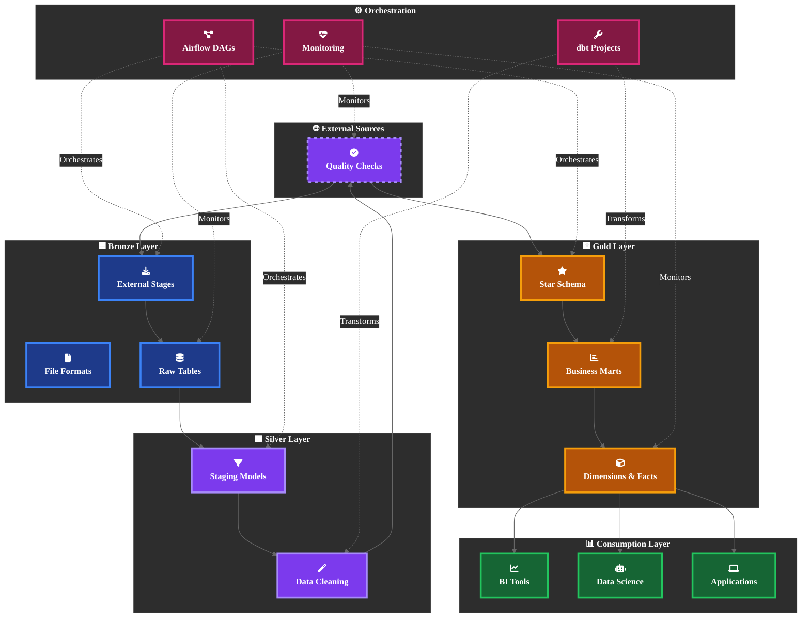
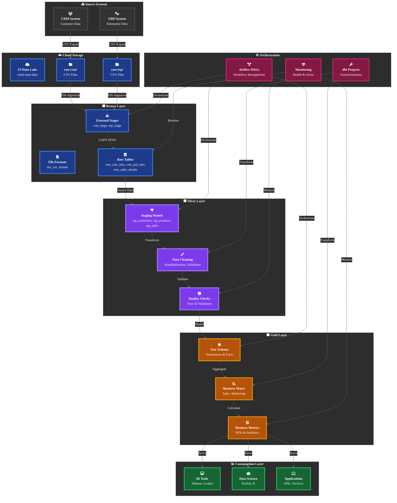
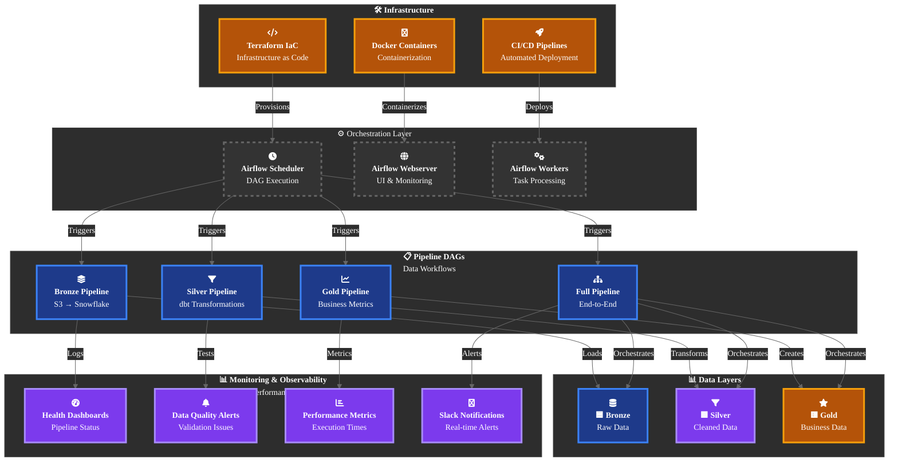
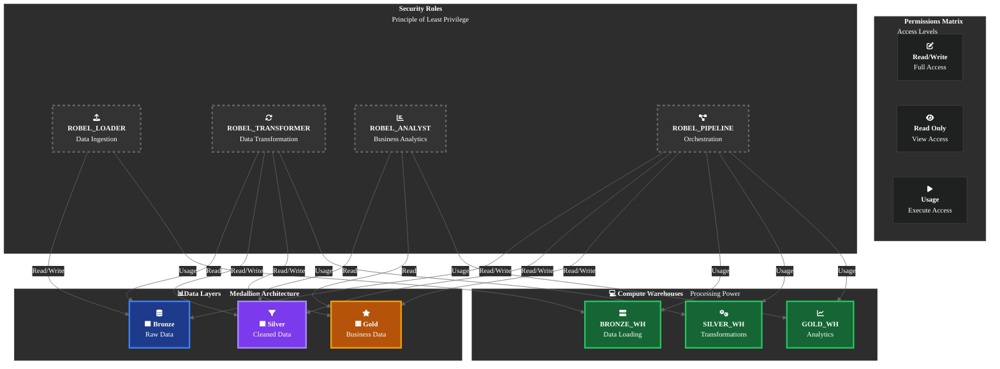

<h1 align="center">🏛️ Modern Data Warehouse Architecture Overview</h1>

<p align="center">
  <b>Snowflake • Medallion Architecture • dbt • Airflow • Power BI</b><br>
  <i>Transforming raw data into trusted, analytics-ready insights</i>
</p>

## 📊 System Architecture Overview


## 🔄 Detailed Data Flow Architecture


## 🏛️ Medallion Architecture Layers

### 🟦 Bronze Layer — Raw Data Preservation

**Purpose:**  
Ingest and preserve source data exactly as received without transformation.

**Components:**

- **External Stages:** Secure connections to S3 buckets (`raw/erp` and `raw/crm`)  
- **File Formats:** Standardized CSV parsing configurations  
- **Raw Tables:** Exact replica of source system schemas  

**Key Characteristics:**

- ✅ **Immutable:** Source data preserved without changes  
- ✅ **Complete:** All source fields and records retained  
- ✅ **Auditable:** Full data lineage from source  
- ✅ **Reliable:** Simple, robust ingestion patterns  

### 🟩 Silver Layer — Data Cleaning & Validation

**Purpose:**  
Clean, standardize, validate, and enrich raw data for business use.

**Components:**

- **Staging Models:** dbt models for each source table  
- **Data Cleaning:** Standardization and normalization  
- **Quality Checks:** Automated testing and validation  

**Key Transformations:**

- 🧹 **Data Cleaning:** Trim whitespace, handle nulls  
- 🔄 **Standardization:** Gender codes ('F'/'M' → 'Female'/'Male')  
- 📅 **Date Conversion:** Integer dates (YYYYMMDD) to proper dates  
- 🎯 **Business Logic:** Customer deduplication, product categorization  
- ✅ **Quality Validation:** Uniqueness, completeness, validity checks  

### 🟨 Gold Layer — Business Metrics & Dimensions

**Purpose:**  
Create business-ready data models optimized for analytics and reporting.

**Components:**

- **Star Schema:** Traditional dimensional modeling  
- **Business Marts:** Department-specific data products  
- **Metrics & KPI:** Calculated business indicators  

**Data Models:**

- ⭐ **Dimensions:** `dim_customers`, `dim_products`, `dim_dates`  
- 📊 **Facts:** `fct_sales` (transactional facts)  
- 🎯 **Business Marts:** Sales performance, customer segmentation  
- 📈 **Metrics:** AOV, Growth Rate, Customer LTV, Conversion Rate

## ⚙️ Orchestration & Monitoring Architecture 


## 🛡️ Security & Access Control Architecture
### Role-Based Access Control (RBAC)

## 🛡️ Security Implementation

### 🔒 Network Security
- VPC endpoints for private S3 access  
- Snowflake network policies  
- Encrypted data in transit (TLS 1.2+)  

### 🛡️ Data Protection
- Encryption at rest (AES-256)  
- Column-level security (future)  
- Dynamic data masking (future)  

### 👥 Access Control
- Principle of least privilege  
- Regular access reviews  
- Audit logging and monitoring  

---

## 📈 Scalability & Performance

### 🏗️ Warehouse Sizing Strategy

| Layer  | Warehouse Size | Purpose               | Workload Pattern                  |
|--------|----------------|---------------------|----------------------------------|
| Bronze | X-Small        | Data loading         | Short, bursty (5-10 min)        |
| Silver | X-Small        | Transformations      | Medium complexity (15-30 min)   |
| Gold   | Small          | Analytics & Reporting| Complex aggregations (varies)   |

---

### ⚡ Performance Optimizations

#### Clustering Keys
```sql
-- Cluster large fact tables by date
CREATE TABLE gold.fct_sales CLUSTER BY (order_date);

-- Cluster dimension tables by key
CREATE TABLE gold.dim_customers CLUSTER BY (customer_key);
```
### 🔄 Data Lineage & Governance
## End-to-End Lineage

``` mermaid
%%{init: {'theme':'dark', 'themeVariables': {
  'background': '#1a1a1a',
  'primaryColor': '#2d2d2d',
  'primaryBorderColor': '#404040',
  'lineColor': '#666666',
  'tertiaryColor': '#333333',
  'clusterBkg': '#2d2d2d',
  'clusterBorder': '#404040',
  'nodeBorder': '#404040',
  'fontFamily': 'Times New Roman, serif',
  'fontSize': '14px',
  'textColor': '#ffffff',
  'titleColor': '#ffffff',
  'edgeLabelBackground': '#2d2d2d',
  'edgeLabelColor': '#ffffff'
}}}%%
flowchart TD
    %% === SOURCE FILES ===
    subgraph Sources [&nbsp;&nbsp;&nbsp;&nbsp;<b>📁 Source Files</b>&nbsp;&nbsp;&nbsp;&nbsp;S3 Data Lake]
        S1[<i class='fa fa-file-csv'></i><br/><b>crm_cust_info.csv</b>]
        S2[<i class='fa fa-file-csv'></i><br/><b>crm_prd_info.csv</b>]
        S3[<i class='fa fa-file-csv'></i><br/><b>crm_sales_details.csv</b>]
        S4[<i class='fa fa-file-csv'></i><br/><b>erp_cust_az12.csv</b>]
        S5[<i class='fa fa-file-csv'></i><br/><b>erp_loc_a101.csv</b>]
        S6[<i class='fa fa-file-csv'></i><br/><b>erp_px_cat_g1v2.csv</b>]
    end

    %% === BRONZE LAYER ===
    subgraph Bronze [<b>🟦 Bronze Layer</b>&nbsp;&nbsp;&nbsp;&nbsp;&nbsp;&nbsp;&nbsp;&nbsp;&nbsp;&nbsp;&nbsp;&nbsp;Raw Data Preservation]
        B1[<i class='fa fa-database'></i><br/><b>crm_cust_info</b><br/>Raw customer data]
        B2[<i class='fa fa-database'></i><br/><b>crm_prd_info</b><br/>Raw product data]
        B3[<i class='fa fa-database'></i><br/><b>crm_sales_details</b><br/>Raw sales data]
        B4[<i class='fa fa-database'></i><br/><b>erp_cust_az12</b><br/>Raw ERP customers]
        B5[<i class='fa fa-database'></i><br/><b>erp_loc_a101</b><br/>Raw locations]
        B6[<i class='fa fa-database'></i><br/><b>erp_px_cat_g1v2</b><br/>Raw categories]
    end

    %% === SILVER LAYER ===
    subgraph Silver [<b>🟩 Silver Layer</b><br/>Data Cleaning & Validation]
        S7[<i class='fa fa-filter'></i><br/><b>stg_customers</b><br/>Cleaned customers]
        S8[<i class='fa fa-filter'></i><br/><b>stg_products</b><br/>Cleaned products]
        S9[<i class='fa fa-filter'></i><br/><b>stg_sales</b><br/>Cleaned sales]
        S10[<i class='fa fa-filter'></i><br/><b>stg_erp_customers</b><br/>ERP customers]
        S11[<i class='fa fa-filter'></i><br/><b>stg_erp_locations</b><br/>ERP locations]
        S12[<i class='fa fa-filter'></i><br/><b>stg_erp_categories</b><br/>ERP categories]
    end

    %% === GOLD LAYER - CORE ===
    subgraph GoldCore [<b>🟨 Gold Layer - Core</b><br/>Dimensions & Facts]
        G1[<i class='fa fa-user-circle'></i><br/><b>dim_customers</b><br/>Customer dimension]
        G2[<i class='fa fa-cube'></i><br/><b>dim_products</b><br/>Product dimension]
        G3[<i class='fa fa-calendar'></i><br/><b>dim_dates</b><br/>Date dimension]
        G4[<i class='fa fa-chart-bar'></i><br/><b>fct_sales</b><br/>Sales facts]
    end

    %% === GOLD LAYER - BUSINESS MARTS ===
    subgraph GoldMarts [<b>🌟 Gold Layer - Business Marts</b><br/>Analytics & Metrics]
        M1[<i class='fa fa-tachometer-alt'></i><br/><b>mart_sales_performance</b><br/>Sales KPIs]
        M2[<i class='fa fa-chart-line'></i><br/><b>mart_sales_trends</b><br/>Trend analysis]
        M3[<i class='fa fa-users'></i><br/><b>mart_customer_segmentation</b><br/>Customer segments]
        M4[<i class='fa fa-bullseye'></i><br/><b>mart_customer_acquisition</b><br/>Acquisition metrics]
    end

    %% === BUSINESS CONSUMPTION ===
    subgraph Consumption [<b>📊 Business Consumption</b><br/>Reports & Dashboards]
        C1[<i class='fa fa-desktop'></i><br/><b>Sales Performance</b><br/>Executive dashboard]
        C2[<i class='fa fa-chart-pie'></i><br/><b>Customer Analytics</b><br/>Segmentation reports]
        C3[<i class='fa fa-rocket'></i><br/><b>Marketing Campaigns</b><br/>ROI analysis]
        C4[<i class='fa fa-trophy'></i><br/><b>Business Intelligence</b><br/>Strategic insights]
    end

    %% === DATE DIMENSION (SPECIAL) ===
    D1[<i class='fa fa-magic'></i><br/><b>Date Dimension</b><br/>Generated calendar]

    %% === SOURCE TO BRONZE CONNECTIONS ===
    S1 -->|Ingest| B1
    S2 -->|Ingest| B2
    S3 -->|Ingest| B3
    S4 -->|Ingest| B4
    S5 -->|Ingest| B5
    S6 -->|Ingest| B6

    %% === BRONZE TO SILVER CONNECTIONS ===
    B1 -->|Clean &<br/>Standardize| S7
    B4 -->|Enrich| S7
    B5 -->|Geographic<br/>data| S7
    
    B2 -->|Transform &<br/>Categorize| S8
    B6 -->|Category<br/>hierarchy| S8
    
    B3 -->|Validate &<br/>Recalculate| S9
    
    B4 -->|Standardize| S10
    B5 -->|Normalize| S11
    B6 -->|Classify| S12

    %% === SILVER TO GOLD CORE CONNECTIONS ===
    S7 -->|Create<br/>dimension| G1
    S8 -->|Create<br/>dimension| G2
    S9 -->|Create<br/>fact table| G4
    S10 -->|Merge<br/>data| G1
    S11 -->|Add<br/>location| G1

    %% === GOLD CORE TO GOLD MARTS CONNECTIONS ===
    G1 -->|Customer<br/>metrics| M1
    G2 -->|Product<br/>metrics| M1
    G4 -->|Sales<br/>metrics| M1
    
    G1 -->|Customer<br/>trends| M2
    G2 -->|Product<br/>trends| M2
    G4 -->|Sales<br/>trends| M2
    
    G1 -->|Segment<br/>analysis| M3
    G4 -->|Purchase<br/>behavior| M3
    
    G1 -->|Acquisition<br/>data| M4
    G4 -->|First<br/>purchases| M4

    %% === GOLD MARTS TO CONSUMPTION CONNECTIONS ===
    M1 -->|Performance<br/>KPIs| C1
    M2 -->|Trend<br/>analysis| C1
    M3 -->|Customer<br/>insights| C2
    M4 -->|Campaign<br/>metrics| C3
    M1 -->|Business<br/>metrics| C4
    M2 -->|Growth<br/>trends| C4
    M3 -->|Customer<br/>intelligence| C4

    %% === DATE DIMENSION CONNECTIONS ===
    D1 -->|Generate<br/>calendar| G3
    G3 -->|Time<br/>intelligence| M1
    G3 -->|Trend<br/>analysis| M2
    G3 -->|Cohort<br/>analysis| M4

    %% === STYLING ===
    classDef sources fill:#333333,stroke:#666666,stroke-width:3px,color:#ffffff,stroke-dasharray: 5 5
    classDef bronze fill:#1e3a8a,stroke:#3b82f6,stroke-width:3px,color:#ffffff
    classDef silver fill:#7c3aed,stroke:#a78bfa,stroke-width:3px,color:#ffffff
    classDef goldCore fill:#b45309,stroke:#f59e0b,stroke-width:3px,color:#ffffff
    classDef goldMarts fill:#c2410c,stroke:#ea580c,stroke-width:3px,color:#ffffff
    classDef consumption fill:#166534,stroke:#22c55e,stroke-width:3px,color:#ffffff
    classDef special fill:#831843,stroke:#db2777,stroke-width:3px,color:#ffffff
    
    class S1,S2,S3,S4,S5,S6 sources
    class B1,B2,B3,B4,B5,B6 bronze
    class S7,S8,S9,S10,S11,S12 silver
    class G1,G2,G3,G4 goldCore
    class M1,M2,M3,M4 goldMarts
    class C1,C2,C3,C4 consumption
    class D1 special

```


## ✅ Data Quality Framework

### 🧪 Automated Testing
```yaml
# dbt tests in schema.yml
models:
  - name: stg_customers
    columns:
      - name: cst_id
        tests:
          - not_null
          - unique
      - name: cst_gndr
        tests:
          - accepted_values:
              values: ['Female', 'Male', 'n/a']
```
# 📊 Monitoring Metrics

- **Freshness:** Data updated within expected timeframe  
- **Volume:** Record counts within expected ranges  
- **Quality:** Test failure rates and data validation  
- **Performance:** Pipeline execution times and resource usage  

---

# 🎯 Architecture Principles

- **Separation of Concerns:** Each layer has distinct responsibilities  
- **Immutable Raw Data:** Bronze layer preserves source truth  
- **Incremental Processing:** Efficient handling of growing data  
- **Quality First:** Testing and validation at every layer  
- **Automation:** Infrastructure as Code and CI/CD pipelines  
- **Monitoring:** Comprehensive observability and alerting  
- **Security:** Principle of least privilege and data protection  
- **Scalability:** Designed for 10x growth in data and users  

---

# 🔮 Future Architecture Considerations

- **Real-time Streaming:** Kafka integration for real-time data  
- **Machine Learning:** ML model integration and MLOps  
- **Data Mesh:** Domain-oriented decentralization  
- **Advanced Governance:** Data catalog and lineage tools  
- **Cost Optimization:** Automated warehouse scaling and optimization  

---

This architecture provides a robust, scalable foundation for modern data warehouse that can evolve with business needs while maintaining data quality, security, and performance.

**Last Updated:** 2025-10-13 17:00:00 EAT                                                        
**Architecture Version:** 1.0  
**Maintained by:** Robel Ermiyas
