# ⚙️ Silver Layer Migration — Legacy SQL ➜ dbt

## 🧭 Migration Overview

| **Aspect** | **Details** |
|-------------|-------------|
| **Current State** | SQL Server stored procedures using **full refresh** strategy |
| **Target State** | **dbt incremental models** following modern data engineering best practices |

---

## 🎯 Migration Goals

1. **Performance:** Replace full refresh with **incremental loading** to optimize runtime.  
2. **Maintainability:** Refactor monolithic SQL procedures into **modular, reusable dbt models**.  
3. **Data Quality:** Integrate **dbt tests**, **documentation**, and **schema validation**.  
4. **Collaboration:** Enable version control and **team-based development** with Git.  
5. **Monitoring:** Introduce **observability**, **lineage tracking**, and **build logging** through dbt Cloud or metadata tools.

---

## 🧩 Current Architecture (Legacy SQL Server)

The existing workflow relies on **stored procedures** that truncate and reload entire tables during every run.  
While simple, this method leads to **long runtimes**, **unnecessary compute usage**, and **no change tracking**.

### 🧱 Legacy Implementation (Before Migration)

```mermaid
graph TD
    A[🪣 Bronze Layer Tables] --> B[🧾 Stored Procedures]
    B --> C[🗑️ TRUNCATE Silver Tables]
    C --> D[🔁 Full Reload Process]
    D --> E[📊 Silver Layer Tables]

    %% Styling
    style B fill:#ffdddd,stroke:#cc0000,stroke-width:2px,color:#000
    style C fill:#ffdddd,stroke:#cc0000,stroke-width:2px,color:#000
    style D fill:#ffdddd,stroke:#cc0000,stroke-width:2px,color:#000
    style A fill:#e8f4ff,stroke:#007bff,stroke-width:1px,color:#000
    style E fill:#e8f4ff,stroke:#007bff,stroke-width:1px,color:#000
```

**© 2025 Robel Ermiyas**
